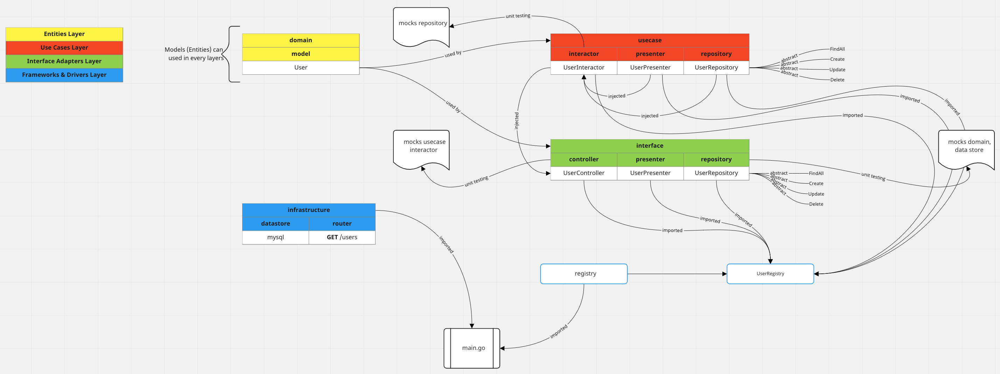

# Go Clean Architecture

Sample repository for implementing a clean architecture with Go.

## How to run

1. Start docker-compose with `docker-compose up -d`
2. Open new terminal, run `make migrate-up` to populate the database
3. Open browser and navigate to http://localhost:8080/users
4. If you want terminate the database, run `make migrate-down`

## Run the tests

```bash
make test
```

## Diagram


